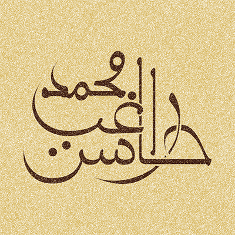

# Assalamu Alaykum

I am Muhammad Ragib Hasin, a Muslim from Bangladesh 🇧🇩, an undergrad student of EEE in Rajshahi University of Engineering and Technology at this moment.

My passion is Quran, coding, calligraphy and languages (programming and human both) 😊.

Bangla is my native tongue, and I am fairly fluent in English. At this moment I am learning Arabic.

I code mainly is TypeScript/JavaScript, Rust, C++, and C#.

That's all. Contact me, if need be.

